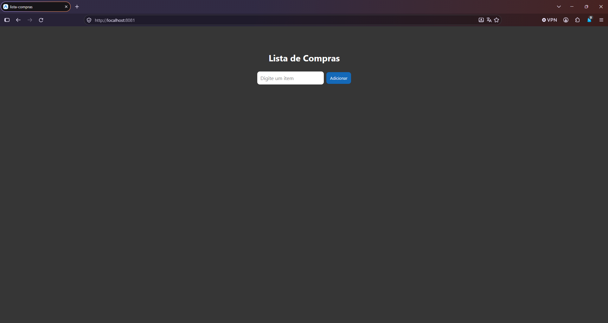
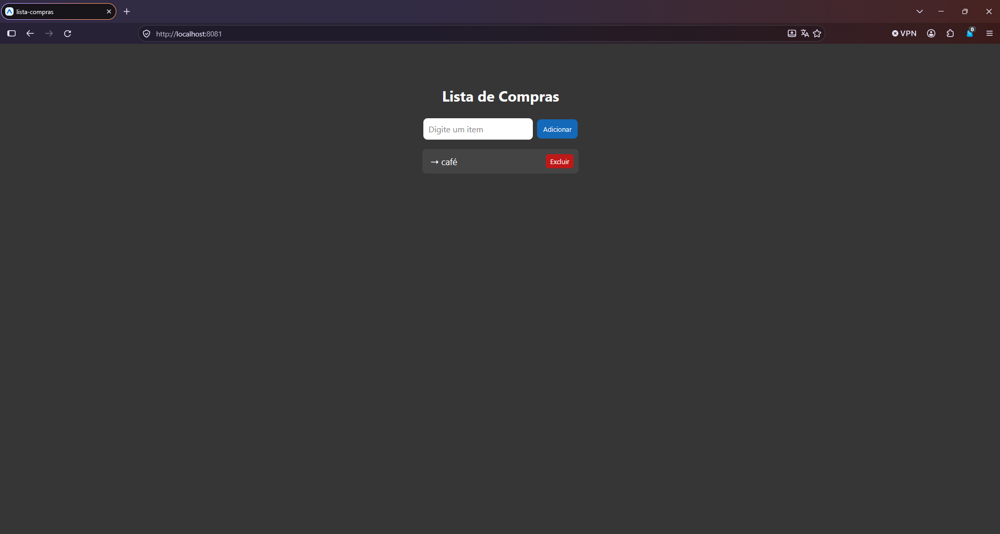
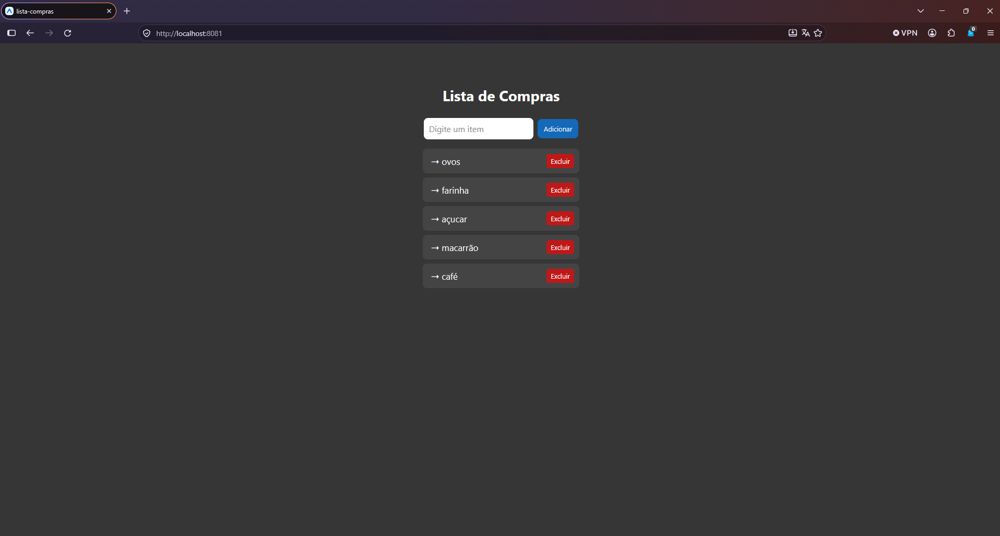

# CheckPoint 2 - Lista de compras 

aplicativo simples de lista de compras feito em react native.

## funcionalidades

- adicionar itens à lista
- visualizar os itens usando FlatList
- excluir itens da lista
- uso de useState para controlar a lista

## tecnologias

- React Native
- Expo
- JavaScript

## prints






## como rodar

1. clone o repositório:

```bash
git clone URL_DO_REPOSITORIO
```
2. instale as dependências:

```bash
npm install
```

3. inicie o projeto:

```bash
npx expo start
```

4. abra o aplicativo pelo **Expo Go** usando o QR Code ou pressione `w` para abrir no navegador.